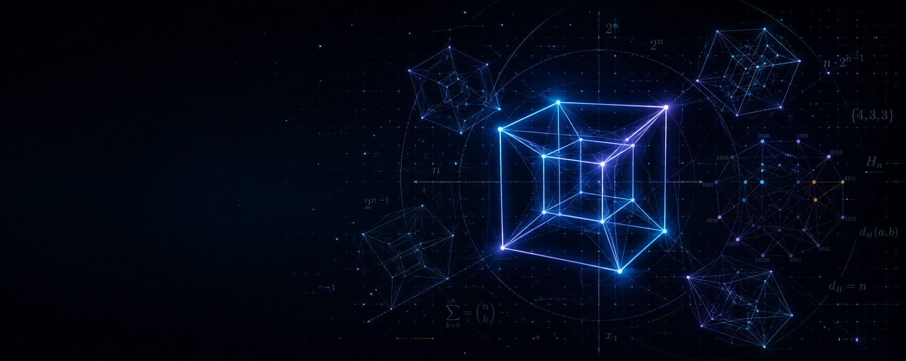

# Hyperdimensional Atlas

<p align="center">
  <a href="https://biswajit1999.github.io/hyperdimensional-atlas/">
    
  </a>
</p>

<p align="center">
  <a href="https://biswajit1999.github.io/hyperdimensional-atlas/">
    
  </a>
  <a href="LICENSE">
    
  </a>
  
  
  
  <a href="https://github.com/Biswajit1999/hyperdimensional-atlas/commits/main">
    
  </a>
</p>

<p align="center">
  <strong>An interactive visual laboratory for geometry beyond three dimensions.</strong><br>
  Explore projected shadows, plane rotations, cross-sections, and exact combinatorics of hypercubes from 0D to 50D.
</p>

<p align="center">
  <a href="https://biswajit1999.github.io/hyperdimensional-atlas/"><strong>Launch the Atlas →</strong></a>
</p>

> **Scientific note:** This project visualises mathematical projections. It is not a direct view of higher-dimensional space, evidence for extra dimensions, or a model of spacetime.

---

## Why I built this

I work on astronomical instrumentation, where high-dimensional spaces are routine: spectra, parameter grids, likelihood surfaces, and model spaces. We do not see these spaces directly; we reason about them through projections, slices, and reduced representations.

Hyperdimensional Atlas applies that same habit to a clean mathematical test case: the `n`-cube. It lets you rotate, slice, and inspect hypercubes while keeping clear about what a visualisation can actually claim.

A four-dimensional cube cannot be drawn directly in three-dimensional space any more than a three-dimensional cube can be drawn on a flat page without distortion. The familiar “cube within a cube” is a projection: a geometrically meaningful shadow, not a photograph of a fourth spatial dimension.

The interface separates mathematics, established physics, and speculation so the tool remains useful for intuition without overstating speculative ideas.

---

## Features

* **Dimensions 0D–50D**
  Full vertex and edge rendering is exact through `8D`. Dimensions `9D–50D` use a deterministic sampled skeleton while retaining exact combinatoric counts.

* **Three projection modes**
  Orthographic, perspective, and staged sequential projection for high-dimensional objects.

* **True plane rotations**
  Rotations occur in coordinate planes `(i, j)`, not around ordinary 3D axes. Includes single-plane and multi-plane presets.

* **Cross-section explorer**
  Slice an `n`-cube through `8D` with a fixed-coordinate hyperplane and inspect the resulting lower-dimensional geometry.

* **Hidden-dimension colour encoding**
  A visual reading aid for projected coordinates, clearly labelled as a display convention rather than a physical property.

* **Live scientific inspector**
  Object name, Schläfli symbol, vertex count, edge count, face counts, hypervolume, and boundary measure update with dimension.

* **Procedural atmosphere**
  CSS visual effects, Three.js starfield, gentle bloom, and no stock images.

* **Interaction tools**
  Ghost trails, vertex markers, wireframe toggle, FPS monitor, keyboard shortcuts, reduced-motion support, and WebGL fallback handling.

---

## Mathematical foundations

For a centred `n`-cube on `[-1, +1]^n`:

| Quantity              | Formula                      |
| --------------------- | ---------------------------- |
| Vertices              | `V = 2^n`                    |
| Edges                 | `E = n · 2^(n−1)`            |
| `k`-faces             | `f_k(n) = C(n, k) · 2^(n−k)` |
| Hypervolume, side `s` | `V_n = s^n`                  |
| Boundary measure      | `B_(n−1) = 2n · s^(n−1)`     |

Vertices are enumerated as all possible `±1` coordinate combinations.

Two vertices share an edge exactly when their coordinates differ in one position: Hamming distance one.

A rotation in the coordinate plane of axes `(i, j)` is:

```text
x_i' = x_i cos θ − x_j sin θ
x_j' = x_i sin θ + x_j cos θ
```

Projection to 3D collapses each hidden coordinate `q` using a perspective factor:

```text
f / (f − q)
```

The focal length is clamped to avoid singularities.

Full derivations are available in:

```text
docs/mathematics.md
```

---

## Physics limitations and scientific disclaimer

A tesseract is a four-dimensional **Euclidean spatial** object. It is not spacetime.

Modern physics describes spacetime as three spatial dimensions plus one time dimension. In relativity, time does not behave like an ordinary spatial axis. General relativity models spacetime as a curved four-dimensional manifold.

Frameworks such as Kaluza–Klein theories and string/M-theory use additional spatial dimensions in some theoretical models. However, no confirmed experiment has established large, directly accessible extra spatial dimensions.

This atlas shows mathematical projections, not photographs or direct observations.

> Visual beauty is not evidence. A simulation can build intuition, but it cannot replace measurement.

See:

```text
docs/physics-and-astronomy.md
```

---

## Controls

| Action                    | Control                                             |
| ------------------------- | --------------------------------------------------- |
| Rotate camera             | Drag                                                |
| Zoom                      | Scroll / pinch                                      |
| Change dimension          | Left-panel slider, dimensional ladder, or `←` / `→` |
| Pause / resume rotation   | `Space`                                             |
| Reset camera and rotation | `R` or **Reset view**                               |
| Toggle interface panels   | `H`                                                 |

The left panel also provides controls for:

* Projection mode
* Focal length
* Rotation speed
* Rotation plane
* Wireframe view
* Vertex markers
* Colour encoding
* Ghost trails
* Cross-section explorer

---

## Static deployment with GitHub Pages

This is a static site with no build step.

1. Push the repository to GitHub.
2. Open repository **Settings**.
3. Select **Pages**.
4. Set the source to the default branch.
5. Set the folder to `/` (root).
6. Save.

The site will be served at:

```text
https://biswajit1999.github.io/hyperdimensional-atlas/
```

The project uses relative paths and an import map, so it works from a GitHub Pages project subpath without configuration.

---

## Local preview

ES modules must be served through HTTP. Do not open `index.html` with `file://`.

```bash
# Python 3
python3 -m http.server 8000
```

Or:

```bash
# Node
npx http-server -p 8000
```

Then open:

```text
http://localhost:8000/
```

---

## File structure

```text
/
├── index.html              # Markup, import map, document sections
├── styles.css              # Obsidian Observatory styling
├── favicon.svg
├── README.md
├── LICENSE
├── assets/
│   └── hyperdimensional-atlas-banner.png
├── js/
│   ├── app.js              # Entry point and main render loop
│   ├── constants.js        # Palette and defaults
│   ├── data.js             # Dimension names and Schläfli symbols
│   ├── content.js          # Narrative and inspector copy
│   ├── math/               # Hypercube, projection, rotation, statistics
│   ├── scene/              # Renderer, geometry, materials, effects
│   └── ui/                 # Controls, inspector, narrative panels
├── docs/
│   ├── mathematics.md
│   ├── physics-and-astronomy.md
│   └── references.md
└── assets/                 # Visual assets
```

---

## References

A short, non-fabricated reading list is available in:

```text
docs/references.md
```

It includes standard sources such as:

* H. S. M. Coxeter, *Regular Polytopes*
* Thomas Banchoff’s work on higher-dimensional geometry
* Edwin A. Abbott, *Flatland* — historical fiction and geometric intuition
* Three.js documentation

No invented page numbers, references, or DOIs are included.

---

## Author

Built and maintained by **Biswajit Jana**.

Research interests include astronomical instrumentation, exoplanets, Brown Dwarfs and extreme-precision radial velocity spectroscopy.

* GitHub: https://github.com/Biswajit1999/hyperdimensional-atlas
* Email: [biswajitj998@gmail.com](mailto:biswajitj998@gmail.com)

---

## Citation

If you use or reference this work, please cite:

> Jana, B. (2026). *Hyperdimensional Atlas: an interactive visual laboratory for the geometry of hypercubes (0D–50D)* [Web application]. https://biswajit1999.github.io/hyperdimensional-atlas/

```bibtex
@misc{jana2026hyperatlas,
  author = {Jana, Biswajit},
  title  = {Hyperdimensional Atlas: an interactive visual laboratory
            for the geometry of hypercubes (0D--50D)},
  year   = {2026},
  note   = {Web application},
  url    = {https://biswajit1999.github.io/hyperdimensional-atlas/}
}
```

---

## License

Released under the MIT License. See [LICENSE](LICENSE).

---

Built as a static site.

**Projections, not photographs. No analytics. No server.**

## Research Quality Upgrade

See [RESEARCH_QUALITY.md](RESEARCH_QUALITY.md) for the validation layer, reference anchors, equations and research boundaries added to this repository.
